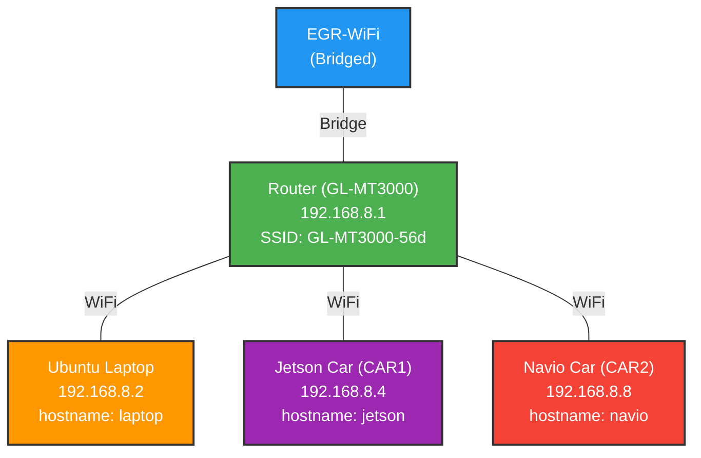

# Hardware Specifications

This document provides detailed hardware information for all components in the RISSAR system.

## Table of Contents

- [CAR1: Jetson](#car1-jetson)
- [CAR2: Navio RPi](#car2-navio-rpi)
- [Ubuntu Laptop](#ubuntu-laptop)
- [Router WLAN](#router-wlan)

## CAR1: Jetson

### Credentials
- **Username**: `user`
- **Password**: `password`
- **Static IP**: `192.168.8.4`
- **Hostname**: `jetson`

### Hardware Components
- **Platform**: [RACECAR/J](https://racecarj.com/)
- **Carrier Board**: ReComputer J401
- **Compute Module**: Jetson Orin Nano

### Software Stack
- **JetPack**: 6.2
- **Operating System**: Ubuntu 22.04
- **ROS Version**: [ROS2 Humble](https://docs.ros.org/en/humble/index.html)

### SD Card Image
- **Image Name**: `jetson-car.img`
- **Required Size**: 64 GB minimum
- **Description**: Preconfigured with all packages needed for this repository

### Useful Documentation
- [Jetson Initial Setup Guide](https://www.jetson-ai-lab.com/initial_setup_jon.html#__tabbed_1_2)

## CAR2: Navio RPi

### Credentials
- **Username**: `pi`
- **Password**: `password`
- **Static IP**: `192.168.8.8`
- **Hostname**: `navio`

### Hardware Components
- **Compute Module**: Raspberry Pi 3 Model B+
- **Flight Controller**: [Emlid Navio2](https://docs.emlid.com/navio2/)

### Software Stack
- **ROS Version**: [ROS1 Noetic](https://wiki.ros.org/noetic/)
- **Operating System**: [Emlid Raspbian Pi OS Buster](https://docs.emlid.com/navio2/configuring-raspberry-pi/)
  - Required for Navio2 compatibility
  - Comes preloaded with ROS1 Noetic
  - Compressed in `.xz` format (must be decompressed before flashing)

### SD Card Image
- **Image Name**: `navio-car.img`
- **Required Size**: 64 GB minimum
- **Description**: Preconfigured with all packages needed for this repository

## Ubuntu Laptop

### Credentials
- **Username**: `user`
- **Password**: `password`
- **Static IP**: `192.168.8.2`
- **Hostname**: `laptop`

### Software Stack
- **Operating System**: Ubuntu 22.04
- **ROS Version**: [ROS2 Humble](https://docs.ros.org/en/humble/index.html)

## Router WLAN

### Credentials
- **Admin Password**: `rissar1`
- **SSID**: `GL-MT3000-56d`
- **SSID Password**: `msurissar`
- **Static IP**: `192.168.8.1`

### Network Configuration

#### Bridged Network
The router is bridged to the EGR-WiFi by default, providing internet connectivity to all clients connected to the WLAN. This configuration can be modified through the router admin interface.

## Network Topology

